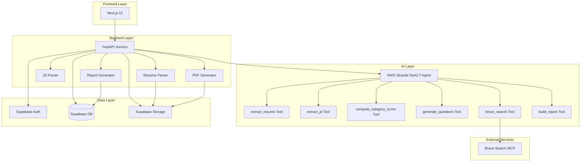

# Design Document: Career Advisor

## Overview

Career Advisor is an AI-powered web application that analyzes the gap between a candidate's qualifications and target job requirements. The system provides comprehensive career guidance through resume analysis, job description parsing, AI-driven gap analysis, and actionable 90-day improvement plans.

### System Architecture

The application follows a three-tier architecture:

1. **Frontend Layer**: Next.js web application providing user interface
2. **Backend Layer**: FastAPI service handling business logic and orchestration
3. **AI Layer**: AWS Strands ReACT agent with specialized tools for analysis

### Key Design Decisions

**AWS Strands ReACT Agent**: Chosen for its ability to reason about complex career analysis tasks and orchestrate multiple specialized tools. The agent can dynamically decide which tools to invoke based on the analysis context.

**Supabase Integration**: Provides unified authentication, database, and storage services, reducing infrastructure complexity and enabling rapid development.

**Session-Based Guest Access**: Allows users to try the system without registration barriers while maintaining data isolation and automatic cleanup.

**Weighted Scoring Model**: Five-category scoring with explicit weights ensures transparent, reproducible fit calculations that align with industry hiring practices.

## Architecture

### System Components



### Component Responsibilities

**Frontend (Next.js)**
- User interface for resume/JD upload
- Display clarifying questions and collect responses
- Render analysis reports with visualizations
- Manage user authentication flows
- Handle guest session management
- Provide report dashboard and sharing controls

**Backend (FastAPI)**
- API endpoint orchestration
- File upload handling and validation
- Session management (guest and authenticated)
- Database operations
- PDF generation coordination
- Access control enforcement

**Resume Parser**
- Extract structured data from PDF/DOCX files
- Parse skills, experience, education, credentials
- Handle parsing errors gracefully
- Validate extracted data completeness

**JD Parser**
- Extract requirements from text, files, or URLs
- Parse required skills, experience level, education, responsibilities
- Fetch content from URLs with error handling
- Normalize job description structure

**AWS Strands ReACT Agent**
- Orchestrate analysis workflow
- Invoke specialized tools based on reasoning
- Generate clarifying questions
- Compute fit scores across categories
- Identify gaps and strengths
- Generate 90-day action plans

**Report Generator**
- Aggregate analysis results into structured reports
- Generate unique report IDs
- Store reports in database
- Format reports for display and PDF export

**PDF Generator**
- Convert reports to PDF format
- Include charts and visual elements
- Maintain formatting and readability
- Optimize for file size and generation speed

**Supabase Services**
- **Auth**: User registration, login, OAuth, password reset
- **Database**: Store users, reports, sessions, sharing settings
- **Storage**: Store resume files, generated PDFs, encrypted at rest

### Data Flow

**Analysis Workflow**:
1. User uploads resume and provides job description
2. Backend validates inputs and stores files
3. Resume Parser extracts structured resume data
4. JD Parser extracts structured job requirements
5. Agent generates clarifying questions
6. User provides answers (or skips)
7. Agent invokes compute_category_score for each of 5 categories
8. Agent identifies gaps and strengths
9. Agent uses brave_search to find learning resources
10. Agent generates 90-day action plan
11. Agent invokes build_report to aggregate results
12. Report Generator stores report in database
13. Frontend displays report to user
14. User can download PDF or share report

## Components and Interfaces

### Frontend Components

**UploadPage**
- Resume file upload (PDF/DOCX, max 10MB)
- Job description input (text/file/URL)
- Input validation and error display
- Progress indicators

**QuestionsPage**
- Display up to 3 clarifying questions
- Collect user responses
- Allow skipping questions
- Submit answers to backend

**ReportPage**
- Display overall fit score with visual gauge
- Show 5 category scores with breakdown
- Render gap analysis (Critical/Moderate/Nice-to-have)
- Display strengths section
- Show 90-day action plan with 3 sprints × 3 tracks
- PDF download button
- Share link generation (authenticated users)

**DashboardPage** (authenticated users)
- List all saved reports
- Display report metadata (role, date, score)
- Sort by creation date
- Delete reports
- Navigate to report details

**AuthPages**
- Registration form with validation
- Login form (email/password and OAuth)
- Password reset flow

### Backend API Endpoints

**POST /api/upload**
- Request: `multipart/form-data` with resume file and JD (text/file/URL)
- Response: `{ session_id, resume_id, jd_id }`
- Validates file size, format
- Stores files in Supabase Storage
- Creates session (guest or authenticated)

**POST /api/parse**
- Request: `{ resume_id, jd_id }`
- Response: `{ resume_data, jd_data }`
- Invokes Resume Parser and JD Parser
- Returns structured data for validation

**POST /api/questions**
- Request: `{ session_id, resume_data, jd_data }`
- Response: `{ questions: [string] }`
- Invokes Agent's generate_questions tool
- Returns up to 3 clarifying questions

**POST /api/analyze**
- Request: `{ session_id, resume_data, jd_data, answers: [string] }`
- Response: `{ report_id }`
- Invokes Agent for full analysis
- Stores report in database
- Returns report ID for retrieval

**GET /api/report/:report_id**
- Request: `report_id` in path, auth token or session ID
- Response: `{ report: Report }`
- Retrieves report from database
- Enforces access control

**GET /api/report/:report_id/pdf**
- Request: `report_id` in path
- Response: PDF file
- Generates PDF from report data
- Caches generated PDFs

**GET /api/dashboard**
- Request: auth token (authenticated users only)
- Response: `{ reports: [ReportMetadata] }`
- Lists all reports for user
- Sorted by creation date descending

**POST /api/share/:report_id**
- Request: `{ enabled: boolean }`
- Response: `{ share_url: string }`
- Enables/disables sharing for report
- Generates or revokes public URL

**DELETE /api/report/:report_id**
- Request: `report_id` in path, auth token
- Response: `{ success: boolean }`
- Deletes report and associated files
- Enforces ownership check

### AWS Strands ReACT Agent Tools

**extract_resume**
- Input: `{ resume_file_path: string }`
- Output: `{ skills: [string], experience: [Experience], education: [Education], credentials: [string] }`
- Extracts structured data from resume file
- Handles PDF and DOCX formats

**extract_jd**
- Input: `{ jd_text: string }`
- Output: `{ required_skills: [string], experience_level: string, education: [string], responsibilities: [string] }`
- Extracts structured requirements from job description
- Normalizes skill names and experience levels

**compute_category_score**
- Input: `{ category: string, resume_data: object, jd_data: object }`
- Output: `{ score: number, reasoning: string }`
- Computes fit score (0-100) for specified category
- Categories: "Software & Technical Skills", "Domain Knowledge", "Experience Depth & Seniority", "Credentials & Education", "Soft Skills & Leadership"
- Returns score with explanation

**generate_questions**
- Input: `{ resume_data: object, jd_data: object }`
- Output: `{ questions: [string] }`
- Generates up to 3 clarifying questions
- Focuses on ambiguities or missing information

**brave_search**
- Input: `{ query: string }`
- Output: `{ results: [SearchResult] }`
- Searches for learning resources, courses, certifications
- Integrates with Brave Search MCP
- Returns relevant URLs and descriptions

**build_report**
- Input: `{ resume_data, jd_data, scores, gaps, strengths, action_plan }`
- Output: `{ report: Report }`
- Aggregates all analysis results
- Structures report with all required sections
- Generates unique report ID

## Data Models

### User
```typescript
interface User {
  id: string;              // UUID
  email: string;
  password_hash: string;   // bcrypt hash
  created_at: timestamp;
  oauth_provider?: string; // 'google' | 'github' | null
  oauth_id?: string;
}
```

### Session
```typescript
interface Session {
  id: string;              // UUID
  user_id?: string;        // null for guest sessions
  created_at: timestamp;
  expires_at: timestamp;   // 24 hours for guests, longer for authenticated
  is_guest: boolean;
}
```

### Resume
```typescript
interface Resume {
  id: string;              // UUID
  session_id: string;
  file_path: string;       // Supabase Storage path
  uploaded_at: timestamp;
  parsed_data: ResumeData;
}

interface ResumeData {
  skills: string[];
  experience: Experience[];
  education: Education[];
  credentials: string[];
}

interface Experience {
  title: string;
  company: string;
  duration: string;
  description: string;
}

interface Education {
  degree: string;
  institution: string;
  year: string;
}
```

### JobDescription
```typescript
interface JobDescription {
  id: string;              // UUID
  session_id: string;
  source_type: 'text' | 'file' | 'url';
  source_content: string;
  parsed_data: JDData;
  created_at: timestamp;
}

interface JDData {
  required_skills: string[];
  experience_level: string;
  education: string[];
  responsibilities: string[];
}
```

### Report
```typescript
interface Report {
  id: string;              // UUID
  session_id: string;
  user_id?: string;        // null for guest reports
  resume_id: string;
  jd_id: string;
  created_at: timestamp;
  
  // Metadata
  candidate_name: string;
  target_role: string;
  
  // Scores
  overall_score: number;   // 0-100
  category_scores: CategoryScores;
  
  // Analysis
  gaps: Gap[];
  strengths: Strength[];
  action_plan: ActionPlan;
  
  // Sharing
  is_shared: boolean;
  share_token?: string;    // UUID for public URL
  view_count: number;
}

interface CategoryScores {
  software_technical: { score: number; weight: 0.30; reasoning: string };
  domain_knowledge: { score: number; weight: 0.20; reasoning: string };
  experience_seniority: { score: number; weight: 0.25; reasoning: string };
  credentials_education: { score: number; weight: 0.10; reasoning: string };
  soft_skills_leadership: { score: number; weight: 0.15; reasoning: string };
}

interface Gap {
  category: 'Critical' | 'Moderate' | 'Nice-to-have';
  area: string;            // e.g., "Software & Technical Skills"
  description: string;
  impact: string;
}

interface Strength {
  area: string;
  description: string;
  examples: string[];
}

interface ActionPlan {
  sprints: Sprint[];       // Exactly 3 sprints
}

interface Sprint {
  number: 1 | 2 | 3;
  duration_days: 30;
  tracks: {
    skills: ActionItem[];
    experience: ActionItem[];
    credentials: ActionItem[];
  };
}

interface ActionItem {
  title: string;
  description: string;
  resources: Resource[];
  priority: 'High' | 'Medium' | 'Low';
}

interface Resource {
  title: string;
  url: string;
  type: 'course' | 'certification' | 'article' | 'project';
}
```

### Database Schema

**users** table
- id (uuid, primary key)
- email (text, unique)
- password_hash (text)
- created_at (timestamp)
- oauth_provider (text, nullable)
- oauth_id (text, nullable)

**sessions** table
- id (uuid, primary key)
- user_id (uuid, foreign key to users, nullable)
- created_at (timestamp)
- expires_at (timestamp)
- is_guest (boolean)

**resumes** table
- id (uuid, primary key)
- session_id (uuid, foreign key to sessions)
- file_path (text)
- uploaded_at (timestamp)
- parsed_data (jsonb)

**job_descriptions** table
- id (uuid, primary key)
- session_id (uuid, foreign key to sessions)
- source_type (text)
- source_content (text)
- parsed_data (jsonb)
- created_at (timestamp)

**reports** table
- id (uuid, primary key)
- session_id (uuid, foreign key to sessions)
- user_id (uuid, foreign key to users, nullable)
- resume_id (uuid, foreign key to resumes)
- jd_id (uuid, foreign key to job_descriptions)
- created_at (timestamp)
- candidate_name (text)
- target_role (text)
- overall_score (integer)
- category_scores (jsonb)
- gaps (jsonb)
- strengths (jsonb)
- action_plan (jsonb)
- is_shared (boolean)
- share_token (uuid, nullable, unique)
- view_count (integer, default 0)

**Indexes**:
- sessions.user_id
- sessions.expires_at (for cleanup job)
- resumes.session_id
- job_descriptions.session_id
- reports.session_id
- reports.user_id
- reports.share_token (unique)
- reports.created_at (for sorting)

## Correctness Properties

*A property is a characteristic or behavior that should hold true across all valid executions of a system—essentially, a formal statement about what the system should do. Properties serve as the bridge between human-readable specifications and machine-verifiable correctness guarantees.*

Before writing properties, I need to analyze the acceptance criteria to determine which are suitable for property-based testing.


### Property Reflection

After analyzing all acceptance criteria, I've identified the following properties suitable for property-based testing. Here's the reflection to eliminate redundancy:

**Redundancy Analysis**:
- Properties 4.1 and 4.10 both test overall score range [0, 100] - **consolidate into one property**
- Properties 4.7 and 4.8 both test weighted sum calculation - **consolidate into one property**
- Properties 5.7, 5.8, 5.9 all test gap categorization in report sections - **consolidate into one comprehensive property**
- Properties 16.6 and 16.7 both test access control - **consolidate into one property**

**Properties to Include**:
1. Resume data round-trip (1.7)
2. Resume parsing extracts required fields (1.4)
3. Resume parsing errors return messages (1.5)
4. JD data round-trip (2.7)
5. JD parsing extracts required fields (2.6)
6. URL fetch errors return messages (2.5)
7. Question count bounded [0, 3] (3.1)
8. User answers incorporated in analysis (3.4)
9. Overall score in range [0, 100] (4.1, 4.10 consolidated)
10. Category scores in range [0, 100] (4.9)
11. Overall score equals weighted sum (4.7, 4.8 consolidated)
12. Gap categories are valid (5.1)
13. Gaps correctly categorized in report sections (5.7, 5.8, 5.9 consolidated)
14. Each gap has exactly one category (5.10)
15. Each strength has examples (6.4)
16. Action plan has 3 sprints of 30 days (7.1)
17. Each sprint has 3 tracks (7.2)
18. Action plan total duration is 90 days (7.6)
19. Each sprint has at least one action item (7.7)
20. Each action item has resources (7.8)
21. Report contains all required sections (8.1)
22. Report has all 5 category scores (8.3)
23. Report metadata fields present (8.7)
24. Report IDs are unique (8.8)
25. PDF contains all report sections (9.2)
26. Guest session created for guest users (10.2)
27. Session ID provided to guests (10.5)
28. Valid session ID retrieves reports (10.6)
29. User account created on registration (11.3)
30. Session created on login (11.4)
31. Password complexity enforced (11.5)
32. Auth failures return error messages (11.6)
33. Dashboard reports have metadata (12.2)
34. Dashboard reports sorted by date descending (12.3)
35. Deleted reports not retrievable (12.6)
36. Shared reports have unique URLs (13.1)
37. Shared reports accessible without auth (13.3)
38. Non-shared reports deny public access (13.4)
39. Revoked links deny access immediately (13.6)
40. Shared reports track view count (13.7)
41. Invalid inputs return error messages (14.1)
42. Missing fields return specific errors (14.2)
43. Unsupported formats return error messages (14.3)
44. System errors don't expose internals (14.5)
45. Error responses have code and message (14.7)
46. Passwords are hashed (16.4)
47. Users can only access their own reports (16.6, 16.7 consolidated)

### Property 1: Resume Data Round-Trip Preservation

*For any* valid resume data structure (containing skills, experience, education, credentials), serializing the data then deserializing it SHALL produce an equivalent data structure with all fields preserved.

**Validates: Requirements 1.7**

### Property 2: Resume Parsing Extracts Required Fields

*For any* valid resume file, the parsed data SHALL contain all required fields: skills array, experience array, education array, and credentials array.

**Validates: Requirements 1.4**

### Property 3: Resume Parsing Errors Return Messages

*For any* invalid resume input that causes parsing to fail, the system SHALL return an error response containing a descriptive message.

**Validates: Requirements 1.5**

### Property 4: Job Description Data Round-Trip Preservation

*For any* valid job description data structure (containing required_skills, experience_level, education, responsibilities), serializing then deserializing SHALL preserve all fields.

**Validates: Requirements 2.7**

### Property 5: Job Description Parsing Extracts Required Fields

*For any* valid job description input, the parsed data SHALL contain all required fields: required_skills array, experience_level string, education array, and responsibilities array.

**Validates: Requirements 2.6**

### Property 6: URL Fetch Errors Return Messages

*For any* URL fetch failure (network error, timeout, invalid URL), the system SHALL return an error response with a descriptive failure reason.

**Validates: Requirements 2.5**

### Property 7: Clarifying Questions Count Bounded

*For any* valid resume and job description pair, the generated clarifying questions list SHALL contain between 0 and 3 questions inclusive.

**Validates: Requirements 3.1**

### Property 8: User Answers Incorporated in Analysis

*For any* set of user-provided answers to clarifying questions, the answers SHALL be included in the analysis engine's input context.

**Validates: Requirements 3.4**

### Property 9: Overall Fit Score Range

*For any* valid analysis inputs, the computed overall fit score SHALL be between 0 and 100 inclusive.

**Validates: Requirements 4.1, 4.10**

### Property 10: Category Scores Range

*For any* valid analysis inputs, each of the five category scores SHALL be between 0 and 100 inclusive.

**Validates: Requirements 4.9**

### Property 11: Overall Score Weighted Sum Calculation

*For any* set of category scores with their defined weights (30%, 20%, 25%, 10%, 15%), the overall score SHALL equal the sum of (category_score × category_weight), within a tolerance of 0.01 for floating-point precision.

**Validates: Requirements 4.7, 4.8**

### Property 12: Gap Categories Are Valid

*For any* identified gap in the analysis, the gap's category field SHALL be one of: "Critical", "Moderate", or "Nice-to-have".

**Validates: Requirements 5.1**

### Property 13: Gaps Correctly Categorized in Report

*For any* report with identified gaps, all gaps with category "Critical" SHALL appear in the Critical Gaps section, all gaps with category "Moderate" SHALL appear in the Moderate Gaps section, and all gaps with category "Nice-to-have" SHALL appear in the Nice-to-have Gaps section.

**Validates: Requirements 5.7, 5.8, 5.9**

### Property 14: Each Gap Has Exactly One Category

*For any* identified gap, the gap SHALL have exactly one category value (not null, not multiple values).

**Validates: Requirements 5.10**

### Property 15: Each Strength Has Examples

*For any* identified strength in a report, the strength SHALL have at least one example in its examples array.

**Validates: Requirements 6.4**

### Property 16: Action Plan Structure - Sprints and Duration

*For any* generated action plan, the plan SHALL contain exactly 3 sprints, and each sprint SHALL have a duration of 30 days.

**Validates: Requirements 7.1**

### Property 17: Each Sprint Has Three Tracks

*For any* sprint in an action plan, the sprint SHALL contain exactly three tracks: skills, experience, and credentials.

**Validates: Requirements 7.2**

### Property 18: Action Plan Total Duration

*For any* generated action plan, the sum of all sprint durations SHALL equal 90 days.

**Validates: Requirements 7.6**

### Property 19: Each Sprint Has Action Items

*For any* sprint in an action plan, at least one of the three tracks SHALL contain at least one action item.

**Validates: Requirements 7.7**

### Property 20: Action Items Have Resources

*For any* action item in an action plan, the action item SHALL have at least one resource with a valid URL.

**Validates: Requirements 7.8**

### Property 21: Report Contains All Required Sections

*For any* generated report, the report SHALL contain all required sections: overall_score, category_scores, gaps, strengths, and action_plan.

**Validates: Requirements 8.1**

### Property 22: Report Has All Five Category Scores

*For any* generated report, the category_scores object SHALL contain all five categories: software_technical, domain_knowledge, experience_seniority, credentials_education, and soft_skills_leadership.

**Validates: Requirements 8.3**

### Property 23: Report Metadata Fields Present

*For any* generated report, the report SHALL contain metadata fields: candidate_name, target_role, and created_at.

**Validates: Requirements 8.7**

### Property 24: Report IDs Are Unique

*For any* two distinct reports generated by the system, their report IDs SHALL be different.

**Validates: Requirements 8.8**

### Property 25: PDF Contains All Report Sections

*For any* generated PDF from a report, the PDF content SHALL include all report sections: scores, gaps, strengths, and action plan.

**Validates: Requirements 9.2**

### Property 26: Guest Session Created

*For any* guest user action (report creation without authentication), a session record SHALL be created in the database.

**Validates: Requirements 10.2**

### Property 27: Session ID Provided to Guests

*For any* guest session creation, the response SHALL include a session identifier.

**Validates: Requirements 10.5**

### Property 28: Valid Session ID Retrieves Reports

*For any* valid session ID within its expiration period, requesting reports with that session ID SHALL return the associated reports.

**Validates: Requirements 10.6**

### Property 29: User Account Created on Registration

*For any* valid registration request (email, password meeting complexity requirements), a user account record SHALL be created in the database.

**Validates: Requirements 11.3**

### Property 30: Session Created on Login

*For any* successful login with valid credentials, an authenticated session SHALL be created.

**Validates: Requirements 11.4**

### Property 31: Password Complexity Enforced

*For any* password submitted during registration, the password SHALL be accepted only if it meets all requirements: minimum 8 characters, at least one uppercase letter, at least one lowercase letter, and at least one number.

**Validates: Requirements 11.5**

### Property 32: Authentication Failures Return Error Messages

*For any* authentication attempt with invalid credentials, the response SHALL contain an error message.

**Validates: Requirements 11.6**

### Property 33: Dashboard Reports Have Metadata

*For any* report displayed in the dashboard, the report SHALL include metadata fields: target_role, created_at, and overall_score.

**Validates: Requirements 12.2**

### Property 34: Dashboard Reports Sorted by Date

*For any* list of reports in the dashboard, the reports SHALL be sorted by created_at in descending order (most recent first).

**Validates: Requirements 12.3**

### Property 35: Deleted Reports Not Retrievable

*For any* report that has been deleted, subsequent attempts to retrieve that report SHALL fail with an error indicating the report does not exist.

**Validates: Requirements 12.6**

### Property 36: Shared Reports Have Unique URLs

*For any* report with sharing enabled, the report SHALL have a unique share_token, and no two shared reports SHALL have the same share_token.

**Validates: Requirements 13.1**

### Property 37: Shared Reports Accessible Without Authentication

*For any* report with sharing enabled (is_shared = true), accessing the report via its public share URL SHALL succeed without requiring authentication.

**Validates: Requirements 13.3**

### Property 38: Non-Shared Reports Deny Public Access

*For any* report with sharing disabled (is_shared = false), accessing the report via a public share URL SHALL return an access denied error.

**Validates: Requirements 13.4**

### Property 39: Revoked Links Deny Access Immediately

*For any* shared report link that is revoked (is_shared changed from true to false), subsequent access attempts via the share URL SHALL immediately return an access denied error.

**Validates: Requirements 13.6**

### Property 40: Shared Reports Track View Count

*For any* shared report accessed via its public URL, the report's view_count field SHALL increment by 1.

**Validates: Requirements 13.7**

### Property 41: Invalid Inputs Return Error Messages

*For any* API request with invalid input data, the response SHALL contain an error message describing the validation failure.

**Validates: Requirements 14.1**

### Property 42: Missing Required Fields Return Specific Errors

*For any* API request missing a required field, the error message SHALL specify which field is missing.

**Validates: Requirements 14.2**

### Property 43: Unsupported File Formats Return Error Messages

*For any* file upload with an unsupported format (not PDF or DOCX), the error response SHALL list the supported formats.

**Validates: Requirements 14.3**

### Property 44: System Errors Don't Expose Internals

*For any* system error (unhandled exception, internal failure), the error message returned to the user SHALL not contain internal details such as stack traces, file paths, or database schema information.

**Validates: Requirements 14.5**

### Property 45: Error Responses Have Code and Message

*For any* error response from the API, the response SHALL include both an error_code field and a message field.

**Validates: Requirements 14.7**

### Property 46: Passwords Are Hashed

*For any* user account in the database, the password_hash field SHALL contain a hashed value (not plaintext), verifiable by checking it doesn't match the original password string.

**Validates: Requirements 16.4**

### Property 47: Users Can Only Access Their Own Reports

*For any* authenticated user attempting to access a report, the access SHALL succeed only if the report's user_id matches the requesting user's ID, or if the report is shared publicly.

**Validates: Requirements 16.6, 16.7**

## Error Handling

### Input Validation Errors

**File Upload Errors**:
- File size exceeds 10MB: Return `400 Bad Request` with message "File size exceeds maximum allowed size of 10MB"
- Unsupported format: Return `400 Bad Request` with message "Unsupported file format. Supported formats: PDF, DOCX"
- Corrupted file: Return `400 Bad Request` with message "Unable to parse file. Please ensure the file is not corrupted"

**Job Description Input Errors**:
- Empty input: Return `400 Bad Request` with message "Job description cannot be empty"
- URL fetch failure: Return `400 Bad Request` with message "Failed to fetch job description from URL: {reason}"
- Invalid URL format: Return `400 Bad Request` with message "Invalid URL format"

**Authentication Errors**:
- Invalid credentials: Return `401 Unauthorized` with message "Invalid email or password"
- Password complexity failure: Return `400 Bad Request` with message "Password must be at least 8 characters and contain uppercase, lowercase, and number"
- Email already exists: Return `409 Conflict` with message "An account with this email already exists"
- Session expired: Return `401 Unauthorized` with message "Session expired. Please log in again"

**Authorization Errors**:
- Accessing another user's report: Return `403 Forbidden` with message "You do not have permission to access this report"
- Accessing non-shared report via public URL: Return `403 Forbidden` with message "This report is not publicly shared"
- Invalid session ID: Return `401 Unauthorized` with message "Invalid or expired session"

### System Errors

**Parsing Errors**:
- Resume parsing failure: Log full error details, return `500 Internal Server Error` with message "Failed to parse resume. Please try a different file"
- JD parsing failure: Log full error details, return `500 Internal Server Error` with message "Failed to parse job description"

**AI Agent Errors**:
- Agent timeout: Return `504 Gateway Timeout` with message "Analysis is taking longer than expected. Please try again"
- Agent tool failure: Log error details, return `500 Internal Server Error` with message "An error occurred during analysis. Please try again"
- Brave Search API failure: Log error, continue with analysis using cached/fallback resources

**Database Errors**:
- Connection failure: Log error, return `503 Service Unavailable` with message "Service temporarily unavailable. Please try again later"
- Query timeout: Log error, return `504 Gateway Timeout` with message "Request timed out. Please try again"
- Constraint violation: Log error, return `409 Conflict` with appropriate message

**Storage Errors**:
- Upload failure: Log error, return `500 Internal Server Error` with message "Failed to upload file. Please try again"
- File not found: Return `404 Not Found` with message "File not found"
- Storage quota exceeded: Return `507 Insufficient Storage` with message "Storage limit exceeded"

### Error Response Format

All error responses follow this structure:
```typescript
{
  error_code: string;      // e.g., "INVALID_FILE_FORMAT", "AUTH_FAILED"
  message: string;         // Human-readable error message
  details?: object;        // Optional additional context (not for system errors)
  timestamp: string;       // ISO 8601 timestamp
  request_id: string;      // Unique request identifier for debugging
}
```

### Error Logging

**Log Levels**:
- `ERROR`: System errors, unhandled exceptions, external service failures
- `WARN`: Validation failures, authentication failures, rate limit hits
- `INFO`: Successful operations, user actions
- `DEBUG`: Detailed execution flow (development only)

**Logged Information**:
- Timestamp
- Request ID
- User ID (if authenticated) or Session ID
- Error type and message
- Stack trace (for system errors)
- Request parameters (sanitized, no sensitive data)

### Retry Logic

**Transient Failures**:
- Brave Search API: Retry up to 3 times with exponential backoff (1s, 2s, 4s)
- Database queries: Retry up to 2 times with 1s delay
- File uploads to Supabase: Retry up to 2 times with 2s delay

**Non-Retryable Failures**:
- Validation errors
- Authentication/authorization errors
- Parsing errors (corrupted files)
- User-initiated cancellations

## Testing Strategy

### Testing Approach

The Career Advisor system requires a comprehensive testing strategy combining property-based testing, unit testing, integration testing, and end-to-end testing.

### Property-Based Testing

**Framework**: Use `fast-check` (TypeScript/JavaScript) for property-based testing

**Configuration**:
- Minimum 100 iterations per property test
- Each test tagged with: `Feature: career-advisor, Property {number}: {property_text}`
- Seed-based reproducibility for failed tests

**Property Test Implementation**:

Each of the 47 correctness properties defined above SHALL be implemented as a property-based test. The tests will use generators to create random valid inputs and verify the properties hold across all generated cases.

**Example Generators Needed**:
- `arbitraryResumeData()`: Generate random resume data structures
- `arbitraryJDData()`: Generate random job description data
- `arbitraryScore()`: Generate scores in range [0, 100]
- `arbitraryCategoryScores()`: Generate all 5 category scores
- `arbitraryGap()`: Generate gap with valid category
- `arbitraryActionPlan()`: Generate action plan with 3 sprints
- `arbitraryPassword()`: Generate passwords (valid and invalid)
- `arbitraryEmail()`: Generate email addresses

**Property Test Organization**:
```
tests/
  properties/
    resume-parsing.property.test.ts      # Properties 1-3
    jd-parsing.property.test.ts          # Properties 4-6
    analysis.property.test.ts            # Properties 7-8
    scoring.property.test.ts             # Properties 9-11
    gaps.property.test.ts                # Properties 12-14
    strengths.property.test.ts           # Property 15
    action-plan.property.test.ts         # Properties 16-20
    report.property.test.ts              # Properties 21-25
    sessions.property.test.ts            # Properties 26-28
    auth.property.test.ts                # Properties 29-32
    dashboard.property.test.ts           # Properties 33-35
    sharing.property.test.ts             # Properties 36-40
    validation.property.test.ts          # Properties 41-45
    security.property.test.ts            # Properties 46-47
```

### Unit Testing

**Framework**: Jest (TypeScript/JavaScript)

**Unit Test Coverage**:

**Resume Parser**:
- Parse valid PDF files (2-3 examples)
- Parse valid DOCX files (2-3 examples)
- Handle corrupted files
- Handle files with missing sections
- Extract skills, experience, education, credentials

**JD Parser**:
- Parse text input (2-3 examples)
- Parse file input (2-3 examples)
- Parse URL input (2-3 examples)
- Handle malformed input
- Extract required fields

**Fit Scorer**:
- Verify category weights sum to 1.0
- Verify weighted sum calculation with specific examples
- Handle edge cases (all zeros, all 100s)

**Report Generator**:
- Generate report with all sections
- Handle empty gaps list
- Handle empty strengths list
- Generate unique report IDs

**PDF Generator**:
- Generate valid PDF from report
- Include all sections
- Handle reports with charts
- Handle long action plans

**Session Manager**:
- Create guest sessions
- Create authenticated sessions
- Validate session expiration
- Clean up expired sessions

**Auth Service**:
- Validate password complexity (multiple examples)
- Hash passwords securely
- Verify credentials
- Handle OAuth flow

### Integration Testing

**Framework**: Jest with Supertest for API testing

**Integration Test Coverage**:

**API Endpoints**:
- POST /api/upload: Upload resume and JD, verify storage
- POST /api/parse: Parse files, verify structured data
- POST /api/questions: Generate questions, verify count
- POST /api/analyze: Full analysis flow, verify report
- GET /api/report/:id: Retrieve report, verify access control
- GET /api/report/:id/pdf: Generate PDF, verify content
- GET /api/dashboard: List reports, verify sorting
- POST /api/share/:id: Enable sharing, verify URL generation
- DELETE /api/report/:id: Delete report, verify removal

**AWS Strands Agent**:
- Invoke extract_resume tool with sample files
- Invoke extract_jd tool with sample text
- Invoke compute_category_score for each category
- Invoke generate_questions with sample data
- Invoke brave_search with sample queries
- Invoke build_report with complete analysis data
- Verify agent orchestration flow

**Supabase Integration**:
- User registration and login
- OAuth authentication (mock provider)
- File upload to storage
- Database CRUD operations
- Row-level security policies

**Brave Search MCP**:
- Search for learning resources
- Handle API failures gracefully
- Parse search results

### End-to-End Testing

**Framework**: Playwright or Cypress

**E2E Test Scenarios**:

**Guest User Flow**:
1. Upload resume (PDF)
2. Provide job description (text)
3. Answer clarifying questions
4. View generated report
5. Download PDF
6. Return with session ID to view report again

**Authenticated User Flow**:
1. Register new account
2. Log in
3. Upload resume and JD
4. Complete analysis
5. View report in dashboard
6. Enable sharing
7. Access shared link (in incognito mode)
8. Disable sharing
9. Verify shared link is denied
10. Delete report
11. Verify report is removed from dashboard

**Error Handling Flow**:
1. Upload oversized file (>10MB)
2. Upload unsupported format
3. Provide invalid URL for JD
4. Attempt to access another user's report
5. Attempt to access expired guest session

### Performance Testing

**Framework**: k6 or Artillery

**Performance Test Scenarios**:

**Load Testing**:
- 100 concurrent users creating reports
- Verify response times stay under 60s for analysis
- Verify response times stay under 10s for questions
- Verify response times stay under 10s for PDF generation

**Stress Testing**:
- Gradually increase load to find breaking point
- Verify graceful degradation
- Verify error messages under high load

**Soak Testing**:
- Run 50 concurrent users for 1 hour
- Verify no memory leaks
- Verify no performance degradation over time

### Security Testing

**Manual Security Review**:
- Review authentication implementation
- Review authorization checks
- Review input validation
- Review error messages for information leakage
- Review password hashing implementation
- Review session management
- Review HTTPS enforcement
- Review Supabase security rules

**Automated Security Scanning**:
- Run OWASP ZAP or similar tool against API
- Run npm audit for dependency vulnerabilities
- Run Snyk or similar for code vulnerabilities

### Test Data Management

**Test Fixtures**:
- Sample resumes (PDF and DOCX)
- Sample job descriptions
- Sample parsed resume data
- Sample parsed JD data
- Sample analysis results
- Sample reports

**Test Database**:
- Use separate Supabase project for testing
- Seed with test users and sessions
- Clean up after each test run

**Mocking Strategy**:
- Mock AWS Strands Agent for unit tests
- Mock Brave Search API for unit tests
- Use real services for integration tests
- Use real services for E2E tests (test environment)

### Continuous Integration

**CI Pipeline**:
1. Run linter (ESLint)
2. Run type checker (TypeScript)
3. Run unit tests (with coverage)
4. Run property-based tests
5. Run integration tests
6. Run E2E tests (on PR to main)
7. Generate coverage report (target: 80% coverage)
8. Run security scans

**Test Execution Time Targets**:
- Unit tests: < 2 minutes
- Property tests: < 5 minutes
- Integration tests: < 10 minutes
- E2E tests: < 15 minutes
- Total CI pipeline: < 30 minutes

### Test Coverage Goals

**Code Coverage**:
- Overall: 80% minimum
- Critical paths (auth, scoring, report generation): 90% minimum
- Property-based tests: Cover all 47 properties
- Unit tests: Cover edge cases and error paths
- Integration tests: Cover all API endpoints
- E2E tests: Cover main user flows

## Implementation Notes

### Technology Stack

**Frontend**:
- Next.js 14 (App Router)
- React 18
- TypeScript
- Tailwind CSS for styling
- Recharts for data visualization
- React Hook Form for form handling
- Zod for validation

**Backend**:
- FastAPI (Python 3.11+)
- Pydantic for data validation
- AWS Strands SDK for ReACT agent
- python-multipart for file uploads
- PyPDF2 for PDF parsing
- python-docx for DOCX parsing
- reportlab or WeasyPrint for PDF generation

**Infrastructure**:
- Supabase (Auth, Database, Storage)
- AWS Strands (ReACT Agent)
- Brave Search MCP
- Vercel (Frontend hosting)
- AWS Lambda or Railway (Backend hosting)

### Development Phases

**Phase 1: Core Infrastructure** (Week 1-2)
- Set up Next.js frontend
- Set up FastAPI backend
- Configure Supabase (auth, database, storage)
- Implement basic file upload
- Implement session management

**Phase 2: Parsing and Data Extraction** (Week 3-4)
- Implement Resume Parser (PDF/DOCX)
- Implement JD Parser (text/file/URL)
- Create data models
- Implement database schema
- Write unit tests for parsers

**Phase 3: AI Analysis Engine** (Week 5-7)
- Set up AWS Strands ReACT agent
- Implement 6 agent tools
- Integrate Brave Search MCP
- Implement fit scoring logic
- Implement gap analysis
- Implement strengths identification
- Write integration tests for agent

**Phase 4: Action Plan and Report Generation** (Week 8-9)
- Implement action plan generator
- Implement report generator
- Implement PDF generation
- Create report UI components
- Write unit tests for generators

**Phase 5: User Features** (Week 10-11)
- Implement authentication flows
- Implement dashboard
- Implement report sharing
- Implement guest sessions
- Write E2E tests

**Phase 6: Polish and Testing** (Week 12)
- Implement all property-based tests
- Performance optimization
- Security review
- Bug fixes
- Documentation

### Deployment Strategy

**Environments**:
- Development: Local development with test Supabase project
- Staging: Deployed to Vercel (frontend) and Railway (backend) with staging Supabase
- Production: Deployed to Vercel (frontend) and AWS Lambda (backend) with production Supabase

**Database Migrations**:
- Use Supabase migrations for schema changes
- Version control all migrations
- Test migrations in staging before production

**Monitoring**:
- Supabase dashboard for database metrics
- AWS CloudWatch for Lambda metrics
- Vercel Analytics for frontend performance
- Sentry for error tracking
- Custom logging for analysis pipeline

### Security Considerations

**Authentication**:
- Use Supabase Auth with JWT tokens
- Implement refresh token rotation
- Set appropriate token expiration (15 min access, 7 day refresh)

**Authorization**:
- Implement row-level security in Supabase
- Verify user ownership on all report operations
- Validate session IDs for guest users

**Data Protection**:
- Encrypt resume files at rest (Supabase default)
- Use HTTPS for all communications
- Sanitize all user inputs
- Hash passwords with bcrypt (Supabase default)
- Implement rate limiting on API endpoints

**Privacy**:
- Implement automatic cleanup of guest sessions (24h)
- Implement account deletion with data purge (30 days)
- Don't log sensitive data (passwords, resume content)
- Implement GDPR-compliant data export

### Scalability Considerations

**Caching**:
- Cache generated PDFs (1 hour TTL)
- Cache Brave Search results (24 hour TTL)
- Use Supabase realtime for dashboard updates

**Async Processing**:
- Use background jobs for long-running analysis
- Implement job queue for report generation
- Provide progress updates via WebSocket or polling

**Database Optimization**:
- Index frequently queried fields
- Use JSONB for flexible schema (scores, gaps, action plans)
- Implement pagination for dashboard
- Archive old guest sessions

**Rate Limiting**:
- Limit file uploads: 10 per hour per IP
- Limit analysis requests: 5 per hour per user
- Limit API requests: 100 per minute per user

### Future Enhancements

**Potential Features**:
- Multi-language support
- Resume builder/editor
- Interview preparation tips
- Salary insights
- Job matching recommendations
- Progress tracking over time
- Mentor matching
- Community features (anonymized gap sharing)
- Mobile app
- Browser extension for one-click JD analysis

**Technical Improvements**:
- Implement caching layer (Redis)
- Add GraphQL API option
- Implement real-time collaboration
- Add A/B testing framework
- Implement feature flags
- Add analytics dashboard for admins
